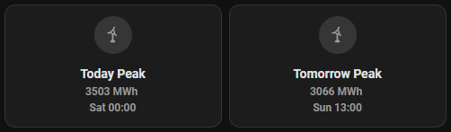

# National Grid Home Assistant Integration


Custom component providing information about the UK National Grid. Provides generation data, forecast data and more from the official endorsed APIs of the UK power network.

This integration is in no way affiliated with or approved by the National Grid.

## Installation
There are two methods of setting up the integration: Either using HACS or manually.

### HACS
[](https://github.com/hacs/integration)

This integration can be added through HACS, this is the easiest and recommended method.

1. [Add the repository to HACS](https://my.home-assistant.io/redirect/hacs_repository/?owner=JRascagneres&repository=HA-NationalGrid&category=integration)
2. Click 'Add' in the prompt
3. Once redirected click 'Download' in the bottom right

### Manual
1. Download the current repo
2. Place the contents of custom_components into the /config/custom_components folder of your Home Assistant installation

Note: A restart will be required for the integration to be registered.

## Setup
You can optionally provide an API key. The API key is only required for the "current_price" sensor. If you opt not to provide an API key everything else should work as expected, however, you'll be missing that sensor.

If you wish to obtain an API key one must be obtained from the BMRS API following the below instructions. Alternatively simply select the no API key option and skip to the later steps.

1. Register [here](https://www.elexonportal.co.uk/)
2. 'Register now' in the top right and follow the standard process
3. Once the account is created login and you'll see 'My Portal' banner open.
4. Inside the 'My Portal' banner click 'My Profile' - your API key is the 'Scripting Key'

Note: Some users have seen that this key can take a significant period of time to become active. If the API key isn't accepted by the integration I'd recommend installing the integration without a key and then a day later, removing the integration and re-adding it with the key. The reason we recommend installing the integration without a key in the meantime is so that you can build up the data history for the sensors.


Then follow the same steps that are using to setup most integrations:
1. Head to settings then Devices & Services
2. Click 'Add Integration' in the bottom right
3. Search for 'National Grid'
4. Enter API Key and hit Submit
5. Your device and entities will be created

## Sensors
| Name | ID | Description |
| ---- | -- | ----------- |
| National Grid Current Sell Price (optional) | sensor.national_grid_current_sell_price | Current balancing price of Grid |
| National Grid Today Wind Peak | sensor.national_grid_today_wind_peak | Estimated peak wind production of Grid today |
| National Grid Today Wind Peak Time | sensor.national_grid_today_wind_peak_time | Estimated time of peak wind production of Grid today |
| National Grid Tomorrow Wind Peak | sensor.national_grid_tomorrow_wind_peak | Estimated peak wind production of Grid tomorrow |
| National Grid Tomorrow Wind Peak Time | sensor.national_grid_tomorrow_wind_peak_time | Estimated time of peak wind production of Grid tomorrow |
| National Grid Grid Generation Gas MWh | sensor.national_grid_grid_generation_gas_mwh | Current electricity generation from gas in MWh |
| National Grid Grid Generation Oil MWh | sensor.national_grid_grid_generation_oil_mwh | Current electricity generation from oil in MWh |
| National Grid Grid Generation Coal MWh | sensor.national_grid_grid_generation_coal_mwh | Current electricity generation from coal in MWh |
| National Grid Grid Generation Biomass MWh | sensor.national_grid_grid_generation_biomass_mwh | Current electricity generation from biomass in MWh |
| National Grid Grid Generation Nuclear MWh | sensor.national_grid_grid_generation_nuclear_mwh | Current electricity generation from nuclear in MWh |
| National Grid Grid Generation Wind MWh | sensor.national_grid_grid_generation_wind_mwh | Current electricity generation from wind in MWh |
| National Grid Grid Generation Solar MWh | sensor.national_grid_grid_generation_solar_mwh | Current electricity generation from solar in MWh |
| National Grid Grid Generation Pumped Storage MWh | sensor.national_grid_grid_generation_pumped_storage_mwh | Current electricity generation from pumped storage in MWh |
| National Grid Grid Generation Hydro MWh | sensor.national_grid_grid_generation_hydro_mwh | Current electricity generation from hydro in MWh |
| National Grid Grid Generation Other MWh | sensor.national_grid_grid_generation_other_mwh | Current electricity generation from other / unknown sources in MWh |
| National Grid Grid Generation France MWh | sensor.national_grid_grid_generation_france_mwh | Current electricity generation from France interconnectors in MWh |
| National Grid Grid Generation Ireland MWh | sensor.national_grid_grid_generation_ireland_mwh | Current electricity generation from Ireland interconnectors in MWh |
| National Grid Grid Generation Netherlands MWh | sensor.national_grid_grid_generation_netherlands_mwh | Current electricity generation from Netherlands interconnectors in MWh |
| National Grid Grid Generation Belgium MWh | sensor.national_grid_grid_generation_belgium_mwh | Current electricity generation from France interconnectors in MWh |
| National Grid Grid Generation France MWh | sensor.national_grid_grid_generation_france_mwh | Current electricity generation from Belgium interconnectors in MWh |
| National Grid Grid Generation Norway MWh | sensor.national_grid_grid_generation_norway_mwh | Current electricity generation from Norway interconnectors in MWh |
| National Grid Total Generation | sensor.total_generation_mwh | Total generation in MWh |
| National Grid Total Demand MWh | sensor.national_grid_total_demand_mwh | Total electricity demand in MWh. This is all generation with the inclusion of interconnectors and storage. |
| National Grid Total Transfers MWh | sensor.national_grid_total_transfers_mwh | Total electricity transfers in MWh. This is all the transfers which are interconnectors and storage. |
National Grid Grid Generation Fossil Fuel Percentage | sensor.national_grid_fossil_fuel_percentage_generation | Percentage of total grid generation that is generated from fossil fuel sources: Gas, Oil & Coal
National Grid Grid Generation Renewable Percentage | sensor.national_grid_renewable_percentage_generation | Percentage of total grid generation that is generated from renewable sources: Solar, Wind & Hydro
National Grid Grid Generation Low Carbon Percentage | sensor.national_grid_low_carbon_percentage_generation | Percentage of total grid generation that is generated from renewable & low carbon sources: Solar, Wind, Hydro & Nuclear
National Grid Grid Generation Other Percentage | sensor.national_grid_other_percentage_generation | Percentage of total grid generation that is generated from 'other' sources: Nuclear, Biomass & Unknown / Other


Note that the associated time sensors are important. Updates can lag by a few minutes and are in UTC so its possible that 'today' and 'tomorrow' aren't entirely accurate for a period of time.

### Grid Generation Sensor Entity

Name - Grid Generation\
ID - sensor.national_grid_grid_generation\
State - Temporary "Grid Generation"\
Attributes:
```
gas_mwh
oil_mwh
coal_mwh
nuclear_mwh
wind_mwh
national_wind_mwh
embedded_wind_mwh
solar_mwh
pumped_storage_mwh
hydro_mwh
other_mwh
france_mwh
ireland_mwh
netherlands_mwh
biomass_mwh
belgium_mwh
norway_mwh
total_generation_mwh
fossil_fuel_percentage_generation
renewable_percentage_generation
low_carbon_percentage_generation
other_percentage_generation
grid_collection_time
```

### Wind Forecast Entity

Name - Wind Forecast\
ID - sensor.national_grid_wind_forecast\
State - Current hour forecast\
Attributes:
```
forecast:
    - start_time: ...
      generation: ...
...
```

### Wind Forecast Earliest Entity

Name - Wind Forecast Earlist\
ID - sensor.national_grid_wind_forecast_earliest\
State - Current hour earliest forecast\
Attributes:
```
forecast:
    - start_time: ...
      generation: ...
...
```

## Uses / Examples
This section outlines some graphs / views I have personally created with the data provided by the integration.




## Data Sources

### BMRS - Balancing Mechanism Reporting Service
An Elexon developed API responsible for reporting power generation, interconnectors, pricing and wind forecasting.\
Data is provided largely in an XML format but their newer API offers data in JSON too, this integration is moving slowly to the new API, however, the new API is in beta so some endpoint are not yet suitable.

### Carbon Itensity API
A National Grid ESO API developed in partner ship with the University of Oxford is responsible for reporting the carbon intensity of power generation in the UK in grams of carbon dioxide per kilowatt hour.\
Data is provided in JSON format.

### National Grid ESO API
A National Grid ESO API responsible for estimating power generation from embedded solar and wind. This is required as BMRS only reports main grid generation, embedded generation is not counted. Embedded generation being the generation connected to local distribution networks rather than the national transmission network.
